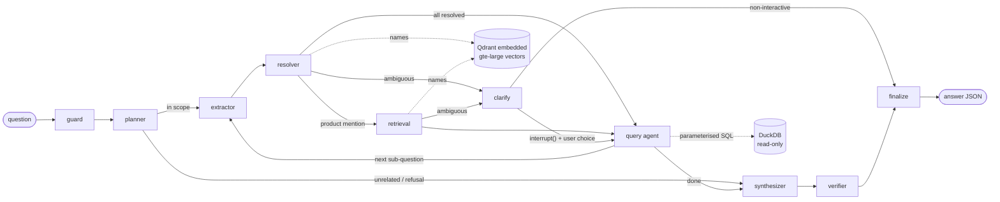

# ChemRAG: a multi-agent orchestrator for the California Safe Cosmetics chemical-disclosure data

Ask a question in plain English, for example *"Which products contain CAS 75-07-0?"*,
*"What chemicals are reported for Sally Hansen in Nail Polish and Enamel?"* or
*"Summarize reporting trends over time for Nail Products"*. Every answer includes:

- **a short answer and details**,
- **evidence**: the cited source rows (`row_id`, `CDPHId`, `CSFId`, `ChemicalId` and the fields used),
- **a query plan**: every agent step, including the exact SQL and the values passed to it,
- **assumptions, warnings and a confidence level**.

The full design is in [`PLAN.md`](PLAN.md). Profiling numbers are in [`docs/profiling_output.txt`](docs/profiling_output.txt).

```
make demo          # creates .venv, builds DuckDB + the Qdrant index, asks 6 sample questions
make ask Q="Which brands report retinyl palmitate in sunscreens?"
```

---

## 1. Quickstart

Requirements: Python 3.11+ on Linux or macOS. The system is CPU-only, runs no servers, and is sized for an 8 GB RAM laptop.

```bash
cp .env.example .env            # optional: set GEMINI_API_KEY; leave it empty for deterministic mode
make setup                      # venv + CPU-only torch + package
make build                      # ETL (≈25 s) + gte-large embeddings of ~3.8k entity names into embedded Qdrant
make demo
chemrag ask "Top 5 companies by number of products containing crystalline silica"
chemrag ask "..." --json        # raw output contract
chemrag replay <request_id>     # re-runs the logged SQL with no LLM and checks the results are identical
chemrag doctor                  # RAM, DB, index, embedding model, Gemini key and model id
make test && make eval          # 85 tests; golden evaluation set
```

| Situation | Behaviour |
|---|---|
| `GEMINI_API_KEY` unset or `--no-llm` | All agents use deterministic rules. Every example below works this way. |
| Gemini call fails (429, timeout, bad JSON) | That agent falls back to rules and adds an `llm_unavailable` warning. |
| gte-large or Qdrant unavailable | Entity resolution uses spelling-based (lexical) matching only, with a `vector_unavailable` info warning. |
| Product names | `make build PRODUCTS=1` also embeds the ~33k product names. This is opt-in (see §6). |

---

## 2. Architecture

The orchestrator is a **LangGraph `StateGraph`**. Every agent is a node. All routing is done by small, deterministic, unit-tested router functions; **the LLM never decides which node runs next and never writes SQL**. [`docs/graph.md`](docs/graph.md) is generated from the compiled graph with `chemrag graph`.



| Node | What it does | LLM? |
|---|---|---|
| **guard** | Caps input at 1,000 characters and strips instruction-like sentences ("ignore previous instructions…"). | no |
| **planner** | Checks scope (in scope / medical advice / unrelated), classifies intent (lookup, list, compare, summarize, trend, data_quality, coverage, out_of_scope) and splits the question into ≤4 sub-questions. | Gemini, with keyword rules as fallback |
| **extractor** | Finds CAS numbers, years and date ranges, discontinued/removed wording, group-by and top-N, plus entity mentions (exact alias matches, cue phrases, quoted product names). Follow-up sub-questions inherit the previous sub-question's constraints. | rules first; Gemini can only *add* mentions it quotes verbatim from the question |
| **resolver** | Maps each mention to canonical IDs, in order: CAS check-digit path → exact/alias match → rapidfuzz spelling score fused with gte-large/Qdrant similarity. Returns ranked candidates and flags ambiguity. | no |
| **retrieval** | Turns product-name mentions into `CDPHId`s using lexical matching, plus vectors when the products index exists. | no |
| **clarify** | Asks which candidate was meant, using LangGraph `interrupt()` in the interactive CLI. With `--json` or `--assume-best` it either returns a `clarification` response or proceeds with the top candidate and a warning. | no |
| **query** | Builds a typed `Filters` object and runs fixed SQL templates. Also handles out-of-range dates, unmatched entities, empty results (re-runs the count with one constraint dropped at a time to show which one emptied the result), dominance, trade-secret and synonym warnings. | no |
| **synthesizer** | Builds a numbered fact sheet (F1..Fn) from query results. The **short answer is templated**. Details are optional Gemini bullets citing `[F#]`, followed by a deterministic listing. | Gemini (details only) |
| **verifier** | Checks that every number is in the facts or rows, every bullet cites existing facts, and the text has no medical advice or prompt echo. If a check fails, the Gemini text is dropped and the templated details are used. | no |
| **finalize** | Builds the response JSON and computes confidence with a documented formula. Saves `runs/<id>.json` for replay. | no |

**State.** One Pydantic `TurnState` (`chemrag/state.py`) flows through the graph. List fields are append-only, so the `trace` *is* the query plan, and a clarification appends a newer resolution instead of overwriting the old one.

---

## 3. Data model & cleaning decisions

Source: 114,635 rows × 22 columns. The ETL (`chemrag/etl/build_db.py`) writes these DuckDB tables: `raw_rows`, `fact_report`, `dim_product`, `dim_chemical`, `dim_chemical_group`, `dim_company`, `dim_brand`, `dim_primary_category`, `dim_subcategory`, `entity_alias`, `dq_issues`, `dataset_meta`. Peak RAM is about 600 MB and the build takes about 25 s.

| Issue found while profiling | Decision |
|---|---|
| No column is a unique row key | `row_id` = 1-based CSV row number, stable and checkable with `sed -n`. The CSV's SHA-256 is stored, and `build` re-runs if the file changes. |
| 254 fully identical duplicate rows | Flagged with `is_exact_dup` and excluded from every query. |
| ~9.3k "duplicate" (CDPHId, CSFId, ChemicalId) rows | These are **re-categorisations**: the same product listed under several categories. They are kept, and a category filter matches a product if *any* of its rows is in that category. |
| `ChemicalId` is **not** a chemical | It is a product-chemical *report* id. A chemical is identified by `CasId` → canonical **chemical group**. |
| Dirty CAS values (`"13463-67-7 "`, `"CAS #79-81-2"`, `"93 15 2"`, `"79812"`, `"asdf"`, an EC number) | Normalised and **check-digit validated** (`etl/cas.py`). Unrecoverable values are filled from the `CasId` when it maps to exactly one valid CAS. Every repair is logged in `dq_issues`. Nothing is guessed: `"50-78-25"` stays invalid. |
| `"Trade Secret"` pseudo-chemical (668 rows, CAS `"0"`) | Counted as a product report, excluded from chemical lists, and reported separately in a warning. |
| Chemical synonyms (14 names map to >1 CAS; 7 CAS map to >1 name) | A curated [`config/chemical_groups.yaml`](config/chemical_groups.yaml) defines **groups** (same substance, e.g. Retinyl palmitate = Vitamin A palmitate = Retinol palmitate) and **families** (related but distinct substances, e.g. retinoids). A name query covers its group, the answer lists the reported names, and related families are mentioned in a warning but never silently added. |
| Removal dates in 2103/2104 (115 rows) | Cleaned date set to NULL (raw value kept). Those rows still count as "removed", with the date treated as unknown. |
| Discontinued before first report (2,866 rows), removed before created (192 rows) | Kept and flagged. |
| `"NA"`/`"None"`/`"N/A"` brands, trailing whitespace, the `"Test"` company record | Placeholder brands become NULL, whitespace is trimmed, and the test record is flagged. |
| Titanium dioxide is in 87% of products | Evidence is sampled evenly across chemicals, and a `dominant_chemical` warning appears in chemical listings. |

**Counting vocabulary.** A *product* is a distinct `CDPHId`. A *report record* is a distinct `ChemicalId`. A *row* is a `row_id`, used for citations.

**Default semantics** (echoed in `assumptions[]` whenever they are used):
- *discontinued* means the product has a DiscontinuedDate.
- *removed/reformulated* means the product-chemical record has a ChemicalDateRemoved.
- *reported in year X* means **InitialDateReported**; you can ask for "most recently reported" instead.
- *contains* includes chemicals that were later removed, and the answer gives the count.
- *last N years* is anchored to the dataset's last date (2020-06-23), not today's date.

---

## 4. Retrieval: gte-large + embedded Qdrant

- **What is embedded:** only **names**. That is ~3.8k entity aliases (chemicals and synonyms, companies, brands, categories) and, optionally, ~33k product names. The 114k rows are never embedded: SQL answers row-level questions exactly, and Qdrant only answers *"which entity did the user mean?"*.
- **Model:** `thenlper/gte-large` (1024-dim) via sentence-transformers on CPU. It loads lazily, so questions answered by exact, alias or CAS matches never load it. Settings are `max_seq_length=64`, `inference_mode`, and capped threads.
- **Score fusion:** `0.65·lexical + 0.35·semantic`. gte-style cosine scores are compressed, so the semantic score is rescaled against a "random pair" floor measured at build time.
  - **Resolved** if score ≥ 0.75 and the runner-up is not within 0.05.
  - **Ambiguous** (clarification) if two *different* entities are within 0.05 of each other.
  - **Not found** below 0.75, with suggestions.

  These thresholds are in `chemrag/settings.py`.
- **Qdrant:** runs in embedded local mode (`QdrantClient(path=...)`) with no server. Each collection is a separate store; see §6 for why.

---

## 5. Evaluation

`make eval` runs [`evals/golden.yaml`](evals/golden.yaml), and `make eval-holdout` runs [`evals/holdout.yaml`](evals/holdout.yaml). Expected values come from **hand-written pandas over the raw CSV** ([`evals/ground_truth.py`](evals/ground_truth.py)), which shares no code with the system. Reports are in [`evals/results/`](evals/results).

Each run checks:
- response type,
- intents,
- resolved entities,
- exact counts, chemical sets, trends, top-N lists and comparisons,
- **citation precision**: every cited row is re-checked against the raw CSV,
- required warnings,
- refusal and clarification behaviour.

| Set (no-LLM mode, lexical resolution) | Cases | Passed | Answer correctness | Citation precision | Entity resolution |
|---|---|---|---|---|---|
| Golden (also used during development, so in-sample) | 35 | 35 | 1.00 | 1.00 | 1.00 |
| Held-out paraphrases, **first run before any fixes** | 14 | **10** | 0.60 | 1.00 | 0.86 |
| Held-out after the generic fixes it exposed (now contaminated) | 14 | 14 | 1.00 | 1.00 | 1.00 |

The honest generalisation number is the **10/14 first run**
([`evals/results/holdout_first_run_untuned.md`](evals/results/holdout_first_run_untuned.md)). It failed on:
- misspelled chemicals with no domain keyword,
- "year by year" phrasing,
- "data problems",
- an unquoted product name.

All four were fixed with general rules, not per-question patches.

The golden set covers:
- every intent;
- misspellings, CAS-only and bare-digit CAS queries, and an invalid CAS check digit;
- synonyms and chemical families;
- out-of-range and invalid dates;
- ambiguous brands and generic product names;
- multi-part and follow-up questions;
- trends, comparisons and top-N;
- empty results with diagnostics;
- data quality and coverage;
- medical refusal, out-of-scope questions, prompt injection and missing entities.

**Tests:** `make test` runs 85 pytest tests covering:
- CAS normaliser cases;
- ETL invariants;
- SQL values are always bound as parameters, never pasted into the SQL text;
- query tools, with replay producing identical results;
- the resolver;
- the verifier;
- graph routers;
- end-to-end graph runs, including interactive clarification resume and a scripted fake Gemini (both a grounded narrative and a hallucinated number that triggers the fallback).

---

## 6. Resource budget (8 GB RAM, CPU only)

| Step | Measured peak RSS |
|---|---|
| `build` ETL step (separate process) | ~0.6 GB |
| `ask`, lexical resolution | ~0.35 GB |
| `ask` with the entities vector store open (512-d offline embedder) | ~0.46 GB |
| `ask` on a product-name question with the optional 33k products store | ~1.4 GB at 512-d; **~2.5 GB estimated at 1024-d**, plus the model |
| gte-large fp32 on CPU (estimate) | ~1.4–1.8 GB, loaded only for fuzzy matches |

Embedded Qdrant loads a whole store into RAM when it opens (float64 vectors plus Python payloads). That is why entities and products are **separate stores**: the large products store only opens for product-name questions, and it is **opt-in** (`make build PRODUCTS=1`). Without it, product names are matched lexically, which already passes the golden and held-out product cases.

DuckDB is limited to `memory_limit=1GB` and 2 threads. If memory is still tight:
1. set `CHEMRAG_EMBED_MODEL=thenlper/gte-base`, then
2. use `--no-vectors`.

---

## 7. Design decisions & trade-offs

- **DuckDB for facts, Qdrant for names.** Numbers always come from SQL. Vectors only help pick *which* entity was meant.
- **No text-to-SQL.** There is a fixed tool set (`find_products`, `count_products`, `chemicals_for`, `trend_by_year`, `dataset_coverage`, `dq_summary`, plus `compare`/`summarize` compositions). SQL is built from enum-whitelisted fragments with bound parameters, and the connection is read-only with external access disabled.
- **LangGraph used narrowly.** It provides a typed graph, conditional edges, `interrupt()` for clarification, and a checkpointer. There are no LangChain agents, retrievers or LLM wrappers. Gemini is called through a one-method `LLMClient` interface (`google-genai`, JSON-schema output, Pydantic-validated).
- **Rules first, LLM second.** The system answers every example correctly with no LLM at all. Gemini improves paraphrase coverage and the readability of the details, and the verifier keeps its text grounded.
- **Curated synonym groups instead of embedding-based chemical synonymy.** There are only 123 names, so a reviewed YAML file is more correct than nearest neighbours.

## 8. Known limitations

- **Neither gte-large nor Gemini was run in the build environment.**
  - Hugging Face downloads were blocked by that sandbox's network policy. The vector path was exercised end to end with the offline `hash-ngram` embedder (same Qdrant code, fusion and calibration).
  - Gemini was tested with a scripted fake client.
  - Run `chemrag doctor` on your machine to confirm the gte-large download and the exact Gemini 3.8 Flash model id (default `gemini-3.8-flash`, set with `CHEMRAG_LLM_MODEL`). Then run `make eval` without `--no-llm` to get LLM-mode numbers.
- The rule-based extractor is pattern-driven. Unusual phrasing may be missed in no-LLM mode, which the held-out set shows. Gemini mode is meant to cover that.
- Dates are handled at year granularity ("June 2019" becomes 2019).
- Comparing more than one dimension at once (e.g. companies × categories) is not supported; `compare` uses the first entity type that has two or more values.
- Embedded Qdrant allows one process per store at a time, so don't run two `chemrag` processes against the same index simultaneously.
- Category membership follows the source data. A product re-categorised across subcategories counts in each of them.

## 9. Layout

```
chemrag/
  graph.py            LangGraph wiring + routers          orchestrator.py  entry point, replay
  state.py            TurnState (graph state)             schemas.py       all Pydantic contracts
  agents/             guard, planner, extractor, resolution (resolver/retrieval/clarify),
                      query_agent, synthesizer, verifier, finalize
  etl/                build_db.py, cas.py, normalize.py
  query/              filters.py (Filters → parameterised WHERE), tools.py (SQL templates)
  retrieval/          resolver.py, embed.py (gte-large / hash-ngram), vector_store.py (Qdrant), build_index.py
  llm/                base.py (interface + LLM schemas), gemini_client.py, null_client.py, prompts/*.md
  render/cli_render.py, cli.py
config/chemical_groups.yaml   evals/   tests/   docs/   scripts/profile_data.py   data/raw/
```
