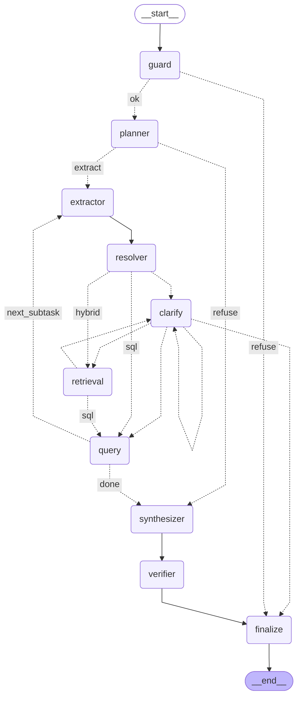

# Orchestrator graph (generated by `chemrag graph`)

```mermaid
---
config:
  flowchart:
    curve: linear
---
graph TD;
	__start__([<p>__start__</p>]):::first
	guard(guard)
	planner(planner)
	extractor(extractor)
	resolver(resolver)
	retrieval(retrieval)
	clarify(clarify)
	query(query)
	synthesizer(synthesizer)
	verifier(verifier)
	finalize(finalize)
	__end__([<p>__end__</p>]):::last
	__start__ --> guard;
	clarify -.-> finalize;
	clarify -.-> query;
	clarify -.-> retrieval;
	extractor --> resolver;
	guard -. &nbsp;refuse&nbsp; .-> finalize;
	guard -. &nbsp;ok&nbsp; .-> planner;
	planner -. &nbsp;extract&nbsp; .-> extractor;
	planner -. &nbsp;refuse&nbsp; .-> synthesizer;
	query -. &nbsp;next_subtask&nbsp; .-> extractor;
	query -. &nbsp;done&nbsp; .-> synthesizer;
	resolver -.-> clarify;
	resolver -. &nbsp;sql&nbsp; .-> query;
	resolver -. &nbsp;hybrid&nbsp; .-> retrieval;
	retrieval -.-> clarify;
	retrieval -. &nbsp;sql&nbsp; .-> query;
	synthesizer --> verifier;
	verifier --> finalize;
	finalize --> __end__;
	clarify -.-> clarify;
	classDef default fill:#f2f0ff,line-height:1.2
	classDef first fill-opacity:0
	classDef last fill:#bfb6fc
```
